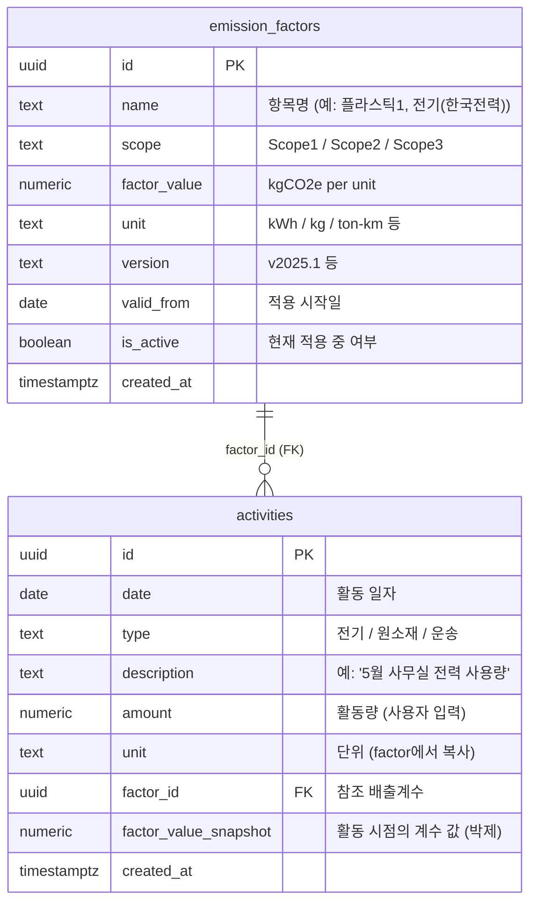

# Hanaloop PCF SaaS - 남윤서

탄소 배출량을 측정·관리·시각화하는 SaaS 플랫폼.
사용자가 활동 데이터(전기/원소재/운송 등)와 배출계수를 입력하면, 시점별 계수를 박제(snapshot)해서 자동으로 PCF를 계산하고 대시보드에 시각화합니다.

## 작업 소요 시간
**5/5 10:00 ~ 5/7 08:00 , 약 46 시간**

| 날짜 | 주요 작업 |
| --- | --- |
| 5/5 | 프로젝트 세팅 + 레이아웃·대시보드·활동·배출계수 페이지 UI 퍼블리싱 |
| 5/6 | Supabase 세팅 + 활동 데이터 API/BFF 연결 |
| 5/7 | 배출계수 API + 대시보드 집계 API + Excel 임포트 + README |

---
### 시간이 많이 소요된 부분

#### 1. 대시보드 집계 로직 (`/api/calculations`)
월별 × 유형별 누적, Scope 1/2/3 분기, 전년·전월 대비 증감률, 감축 인사이트 계산 등.
도메인(PCF) + TypeScript 누적 로직이 익숙하지 않아 **AI가 짠 코드를 한 줄씩 따라가며 의도 검증·수정하는 데 시간이 가장 많이 들었음**.
받은 결과를 그대로 쓰지 않고 어떤 식으로 합산되는지 직접 따라가본 게 도움이 됐다고 생각함.

#### 2. 도메인 이해 (PCF / Scope 분류 / 배출계수 시점 박제)
처음 접하는 도메인이라 "왜 계수를 박제해야 하는지", "Scope 1/2/3이 뭐가 다른지" 개념부터 잡는 데 시간이 필요했음.
초반에 Claude로 도메인 용어를 학습 → 이걸 데이터 모델(`factor_value_snapshot`, `is_active`)에 어떻게 반영할지 결정하는 흐름이 정말 오래걸렸음.

#### 3. 배출계수 활성화 / 이력 / 재적용 워크플로
"같은 항목명에서 active는 항상 1개", "새 버전 활성화 시 기존 자동 비활성화", "이력에서 다른 버전 다시 적용", "바로 적용하기 옵션" 같은 케이스를
빠짐없이 처리하다 보니 분기 정리에 시간이 들었음.

#### 4. Excel 임포트 매핑 로직
헤더 고정(`일자(원본) / 활동 유형 / 설명 / 량 / 단위`)은 정해뒀는데,
사용자가 적은 "설명"과 등록된 배출계수 `name`이 미세한 공백/대소문자/괄호 차이로 어긋나는 경우가 많아
정규화 + 부분 문자열 매칭으로 보강하는 데 시간이 걸림.
고정된 헤더가 아니면 인식을 하지 못하는 문제는 해결하지 못함.

#### 5. 중복 검사 + 병합 모달
중복 정의를 처음에 "월 + 유형"으로 잡았다가,
"날짜 + 유형 + 설명"으로 바꾸고, 모달에서 선택 병합/삭제 UX까지 다듬는 데 추가 시간 사용.

---   
  
## 빠른 시작 (3단계)

```bash
# 1. clone
git clone https://github.com/ysnam0123/hanaloop_FE_nam_yoonseo.git
cd hanaloop_FE_nam_yoonseo

# 2. install
yarn install

# 3. 실행 (빌드 + 서버 시작이 한 번에)
yarn start
```

브라우저에서 [http://localhost:3000](http://localhost:3000) 실행

> Supabase URL/anon key는 `.env.local`에 포함되어 있습니다.
> RLS(Row Level Security)는 비활성화 상태입니다.

---   
  ### 스크린샷                                                                                                                  
                                                                                                               
  #### 대시보드                                                                                                                 
  
                                                                                                                                
  > 대시보드 홈 화면 — 올해 총 배출량 / 전월 대비 / 감축 인사이트 / 월별·유형·Scope 차트                                        
                                                                                                                                
  #### 활동 데이터                                                                                                              
  
                                                                                                                              
     
                                        
                                                                                                                                
  > 활동 데이터 화면 — 입력 내역 테이블 + 총 배출량 / 중복 검사 카드                                                            
                                                            
  #### 배출계수                                                                                                                 
  
                                        
                                        
                                                            
  > 배출계수 화면 — 현재 적용 중인 계수 카드 + 전체 이력 테이블                                                                 
                                                            
  ---    
                                                                                                                                
  ### 화면녹화 (GIF)                   

  #### 대시보드
  
  > 대시보드 홈 화면 — 차트 마우스 호버 시 툴팁 확인 가능

  #### 활동 데이터                                                                                                              
   
  **Excel 임포트**                                                                                                              
  
  > 엑셀 파일을 업로드해 활동 데이터를 일괄 추가합니다.
                                                                                                                                
  **수동 데이터 입력**
  
  > 활동량을 입력하는 동안 예상 배출량과 승용차 km 환산이 실시간으로 갱신됩니다.

  **입력 검증 / 에러 메시지**                                                                                                   
  
  > 활동량 0/음수 입력 시 빨간 메시지로 안내합니다. 배출계수가 등록되지 않은 유형은 토스트로 알려주고 배출계수 탭으로 이동할 수 있습니다.    
                                                                                                                                
  **데이터 수정**
  
  > 기존 활동 데이터를 수정하면 배출량이 자동으로 재계산됩니다.                                                                 
                                                                                                                                
  **중복 데이터 병합**                                                                                                          
  
  > 날짜·유형·설명이 동일한 행이 ⚠️ 로 표시되며, 모달에서 일괄 병합/삭제할 수 있습니다.
 
  **테이블 필터링**
  
  > 기간(월) / 유형 / 검색어로 활동 데이터를 필터링할 수 있습니다.                                                            
 

  #### 배출계수
                                                                                                                                
  **배출계수 추가**                                                                                                             
  
  > 새 항목 또는 기존 항목의 새 버전을 등록합니다. "바로 적용하기" 옵션으로 즉시 활성화 여부를 선택합니다.                      

  **입력 검증 / 에러 메시지**                                                                                                   
  
  > 빈 값으로 저장 시 모든 필수 필드(항목명/Scope/단위/계수값/버전명/적용 시작일)에 빨간 메시지가 표시됩니다.
      
  **배출계수 적용 취소**
  
  > 현재 적용 중인 계수를 비활성화합니다. 이후 활동 데이터엔 영향 없고, 과거 데이터는 박제된 계수로 유지됩니다.
                                                                                                                                
  **이력에서 다른 버전으로 적용**                                                                                               
  
  > 이력 모달에서 과거 버전을 선택해 다시 활성화할 수 있습니다.                                                                 
                                                                                                                                
  ---  

---

## 시스템 개요

### 페이지 구성

#### `/dashboard` — 대시보드

- 올해 총 배출량 (전년 대비 증감률 표시)
- 이번 달 배출량 + 전월 대비 증감률
- 감축 인사이트 (가장 비중 큰 유형 + 추정 절감 가능량)
- 월별 × 유형별 누적 막대 그래프
- 유형별 비중 도넛 차트
- Scope 1/2/3 월별 추이 라인 차트
- 헤더의 연도 셀렉터로 모든 위젯 데이터 일괄 갱신

#### `/activities` — 활동 데이터

- 활동 입력 / 수정 / 삭제 (CRUD)
- 입력 모달 창에서 **실시간 예상 배출량 + 승용차 km 환산** 미리보기
- Excel 파일(`.xlsx`) 일괄 업로드 — 헤더 고정: `일자(원본) / 활동 유형 / 설명 / 량 / 단위`
- 중복 검사: `날짜 + 유형 + 설명`이 같은 행을 ⚠️ 표시 + 일괄 병합/삭제 모달
- 기간(월) / 유형 / 검색어 필터, 페이지네이션 (10건/페이지)
- 헤더 연도와 연동 — 연도 변경 시 월 옵션 자동 갱신 + month 필터 리셋
- 하단 카드: 현재 필터 기준 총 배출량 + 데이터 건수 + 개월 수

#### `/factors` — 배출계수

- 현재 적용 중인 계수 카드 + 전체 이력 테이블
- 신규 등록 시 두 가지 모드: **기존 항목 새 버전** 또는 **새 항목 직접 입력**
- "바로 적용하기" 체크박스 — 해제하면 이력으로만 저장
- 같은 항목명에서 버전 교체 시 기존 active 자동 비활성화
- 적용 취소 / 이력 모달에서 다른 버전으로 다시 적용
- 단위 입력 시 `CO2` → `CO₂`, `CH4` → `CH₄`, `N2O` → `N₂O` 자동 변환
- Scope / 상태(현재 적용/이력) / 항목명 검색 필터

### 데이터 흐름

```
사용자 입력 (활동/계수)
  ↓
useState 폼 상태 + 인라인 검증
  ↓
react-query mutation
  ↓
/api/* (Next.js Route Handler)
  ↓
Supabase (PostgreSQL)
  ↓
응답 시 emission 자동 재계산 (amount × factor_value_snapshot)
  ↓
react-query 캐시 갱신
  ↓
테이블/차트 즉시 반영
```

### 폴더 구조

```
app/
├── activities/page.tsx        활동 데이터 페이지
├── factors/page.tsx           배출계수 페이지
├── dashboard/page.tsx         대시보드 페이지
└── api/
    ├── activities/            CRUD + import + merge
    ├── factors/               CRUD + activate + deactivate
    └── calculations/          대시보드 집계

components/
├── activities/
│   ├── activityModal/         (ActivityModal, TypeSelector, EmissionPreview)
│   ├── bottomStats/           (TotalEmissionCard, DuplicateCard)
│   ├── duplicateModal/        (DuplicateModal, DuplicateSummary, DuplicateActions)
│   ├── deleteModal/
│   └── table/                 (ActivityTable, ActivityToolbar, Pagination)
├── factors/
│   ├── factorModal/           (FactorModal, NameSelector, FactorFields)
│   ├── factorTable/           (FactorTable, FilterRow)
│   ├── FactorCards.tsx
│   └── HistoryModal.tsx
├── dashboard/
│   ├── SummaryCards.tsx
│   ├── MonthlyChart.tsx
│   ├── DonutChart.tsx
│   └── ScopeLineChart.tsx
├── common/
│   └── Pagination.tsx         활동/배출계수 페이지가 공유
└── layout/                    Header, Sidebar, Toast

hooks/                         react-query 훅 (페이지 단위)
lib/
├── api/                       fetch 래퍼 (activities, factors, calculations)
├── calculations.ts            도메인 계산 (calcEmission 등)
├── supabase.ts                Supabase 클라이언트
└── chartColors.ts
types/                         Activity, Factor, DashboardData, DuplicateGroup
```

### 기술 스택

- **Framework**: Next.js 16 (App Router) + TypeScript
- **DB**: Supabase (PostgreSQL)
- **상태/캐시**: TanStack React Query
- **차트**: Recharts
- **스타일**: Tailwind CSS v4
- **Excel 파싱**: SheetJS (xlsx)

---

## 데이터 모델 (ERD)



**핵심 컬럼**

- `factor_value_snapshot`: 활동 입력 시점의 계수 값을 박제. 나중에 계수가 바뀌어도 과거 배출량은 흔들리지 않음.
- `is_active`: 같은 `name` 그룹에서 항상 1개만 `true`. 새 버전 활성화 시 기존 active를 자동 비활성화.

---

## 핵심 도메인 결정 ("왜 이렇게 설계했는가")

### 1. 활동 시점의 배출계수를 스냅샷 박제

`factor_value_snapshot` 컬럼에 활동 입력 시점의 `factor_value`를 복사 저장.
배출계수가 새 버전으로 교체돼도 과거 활동의 배출량 계산 결과는 그대로 유지됨.

> **왜**: PCF 회계는 시점별 정확성이 핵심. "2024년 전기 1kWh = 0.4781 kgCO₂e"는 2025년에 계수가 바뀌어도 변하면 안 됨.
> 변경 가능하게 두면 감사 추적이 깨지고 과거 보고서 신뢰성이 떨어짐.

### 2. 중복 정의를 "날짜 + 유형 + 설명"으로

같은 `date + type + description` 행이 2건 이상이면 중복으로 표시 (⚠️) → 사용자가 일괄 병합/삭제 가능.

> **왜**: 처음엔 "월 + 유형"으로 잡았는데, 실무에선 같은 5월에 다른 설명("플라스틱1" / "플라스틱2")이면 별개 활동임. 의미 단위에 맞춰 정의를 바꿈.

### 3. 비전문가용 환산값 동시 표시

- `0.0231 kgCO₂e` 같은 숫자는 와닿지 않음 → **"≈ 승용차 약 110 km 주행과 동일"** 환산을 활동 입력 모달에서 실시간으로 표시
- 단위는 `kgCO₂e`(소문자 `kg`, 아래첨자 `₂`)로 일관 표기, 사용자가 `kgCO2e`로 입력해도 자동으로 `CO₂`로 변환

> **왜**: 평가 기준 "비전문가도 직관적으로 이해". 도메인 숫자에 익숙치 않은 경영자/실무자가 의미를 즉시 파악할 수 있어야 함.

### 4. "바로 적용하기" 옵션

새 배출계수를 추가할 때 기본은 즉시 활성화이지만, 체크 해제 시 이력으로만 저장 가능.

> **왜**: 미래 적용용 계수(예: 6월 1일부터 발효)를 미리 등록해두는 워크플로 지원. 무조건 자동 활성화면 그 시나리오가 막힘.

---

## 설계 Trade-off

### 1. 트랜잭션 미적용

배출계수 활성화 교체(기존 비활성화 + 새 row 활성화), Excel 임포트 일괄 insert 등은 `update` + `insert`를 분리 호출. RPC(stored procedure)로 묶지 않음.

- **선택 이유**: 단일 사용자 시나리오에서 동시성 충돌 가능성이 거의 없고, 구현 단순성을 우선.
- **위험**: 첫 번째 호출 성공 후 두 번째가 실패하면 데이터 일관성 깨질 수 있음.
- **운영 시 보강**: Supabase RPC 한 번으로 묶으면 atomicity 확보 가능.

### 2. 폼 검증 라이브러리(zod) 미도입

활동/배출계수 모달의 입력 검증을 단순 `if`문으로 처리. zod 같은 스키마 라이브러리 안 씀.

- **선택 이유**: 폼이 2~3개라 추가 의존성 도입 가치 낮음. 인라인 검증으로 충분.
- **확장 시**: 폼이 늘어나거나 API 입력 검증까지 통합하려면 zod로 옮기는 게 깔끔.

### 3. 배출량을 DB에 저장하지 않고 응답 시 재계산

`emission` 컬럼을 DB에 두지 않음. GET 응답마다 `amount × factor_value_snapshot`로 계산해서 내려줌.

- **선택 이유**: 저장값과 derived값 사이 불일치 위험 제거. 단일 진실원은 `factor_value_snapshot`.
- **단점**: 행 수가 매우 많아지면 응답 시 계산 비용 증가. 현재 규모에선 무시 가능.

---

## PCF 계산 결과 시각화 위치

| 위치                             | 무엇                                              |
| -------------------------------- | ------------------------------------------------- |
| 대시보드 `SummaryCards`          | 올해 총 배출량, 전년·전월 대비 %, 최대 비중 유형  |
| 대시보드 `MonthlyChart`          | 월별 × 유형별 누적 막대                           |
| 대시보드 `DonutChart`            | 유형별 비율 도넛                                  |
| 대시보드 `ScopeLineChart`        | 월별 × Scope1/2/3 추이 (GHG 표준 분류)            |
| 활동 입력 모달 `EmissionPreview` | 입력하는 동안 실시간 예상 배출량 + 승용차 km 환산 |
| 활동 데이터 테이블               | 행 단위 배출량 (kgCO₂e) 컬럼 + 총 배출량 카드     |

---

## 입력 검증 / 에러 처리

### 활동 데이터 모달

- **활동량 ≤ 0**: 인라인 빨간 메시지 "활동량은 0보다 커야 합니다"
- **배출계수 미등록 유형**: TypeSelector에 경고 + 배출계수 탭 이동 링크 / 저장 시도하면 토스트
- **저장 시 API 에러**: react-query `onError`에서 토스트

### 배출계수 모달

- **빈 모달 저장 시**: 모든 필수 필드(항목명/Scope/단위/계수값/버전명/적용 시작일)에 빨간 메시지
- **계수값 ≤ 0**: "0보다 큰 값을 입력해주세요"
- **기존 항목 선택 시 Scope 잠금**: 선택한 항목의 Scope를 따라가야 하므로 Scope 버튼 비활성화

### Excel 임포트

- **factor 매핑 실패 행**: 응답에 `errors[]`로 모이고 토스트로 "N건 추가 · M건 실패" 안내

---

## 단위 표기 정책

- 배출량은 모두 `kgCO₂e` (`kg` 소문자, `₂` 아래첨자)
- 활동량 단위: `kWh` (전기), `kg` (원소재), `ton-km` (운송) 등 factor의 unit을 따라감
- 배출계수 단위: `kgCO₂e/kWh`, `kgCO₂e/kg` 처럼 분모에 활동 단위
- 사용자가 `kgCO2e` / `CH4` / `N2O` 입력해도 `CO₂` / `CH₄` / `N₂O`로 자동 변환

---

## AI 도구 사용 내역

### 사용 도구
- **Claude Code (Sonnet/Opus)** — 코드 작성·리팩터링·디버깅 페어 작업, README 초안                                                                                                                                        
- **Claude** — 도메인 용어 학습, 도메인 구조 파악
- **Google Stitch** — 디자인 초안 생성                                                                                                                                                                                    
- **Figma** — Stitch 디자인을 본인이 직접 수정/정리

 ### AI에게 위임한 작업
- **디자인 초안 생성** (Google Stitch) → 본인이 Figma에서 정리/수정
- **퍼블리싱 (Tailwind + 컴포넌트 코드)** — Figma 디자인을 Claude Code로 전환
- **DB 스키마 / API 설계 문서화** — 본인이 요구사항 설명 → AI가 supabase SQL 정리
- **대시보드 집계 로직** (`/api/calculations`의 `sumEmission`, `changeRate`, `monthlyByType` 누적, `scopeMonthly` 분류, `calcInsight` 등)
- **솔직히 도메인+TS 누적 로직이 어려워 AI 의존도 높았음**. AI가 작성한 코드를 본인이 검토하고 의도와 맞는지 확인
- **타입 에러 / 빌드 에러 진단** — Claude Code에 에러 출력 붙여 원인+해결책 받음
- **컴포넌트 분리 실행** — 본인이 "어디를 분리할지" 지시, AI가 props 설계 + 코드 이동
- **README 초안** — 구조와 표현은 AI 초안, 실제 내용은 본인 검증/수정

### AI 사용에 대한 솔직한 회고                                 
- **잘 한 점**: AI가 짠 코드를 그대로 받지 않고 "왜 이렇게 짰는지", "내 의도와 맞는지" 매번 검증. 본인이 거절한 AI 제안도 있음 (`useFactorForm` 훅 추출).
- **한계**: 대시보드 집계 로직(`/api/calculations`의 월별 × 유형별 누적, Scope 분기, 인사이트 계산)은 도메인 + TS 누적 패턴이 어려워 AI 의존도 높았음. 받은 코드를 동작 검증 + 변형하는 방식으로 가져감.                 

---     

## 평가 기준 충족 매핑

### 필수

- [x] PCF 계산 결과 시각화 (대시보드 4 위젯 + 활동 모달 EmissionPreview)
- [x] 데이터 값 정확성, 단위 표시 (kgCO₂e, kWh/kg/ton-km, 자동 변환)
- [x] 입력 오류 시 에러 메시지 (활동/배출계수 모달 인라인 + 토스트)
- [x] UI 실행 비디오 + 스크린샷
- [x] 5단계 이내 실행 (실제 3단계: clone / install / start)
- [x] AI 도구 사용 내역 (위 섹션)
- [x] 시스템 설명 + 설계 내용 (위 섹션들)
- [x] Public GitHub + 커밋 히스토리

### 권장

- [x] ERD 다이어그램 (Mermaid)
- [x] 설계 결정 2개 이상 (4개)
- [x] Trade-off 1개 이상 (3개)

### 보너스

- [x] **Excel 임포트** (헤더는 고정 `일자(원본) / 활동 유형 / 설명 / 량 / 단위`, 공백/대소문자 무시 매칭)
- [ ] Docker Compose
- [ ] OpenAPI/Swagger
- [ ] 타 시스템과 비교

---
